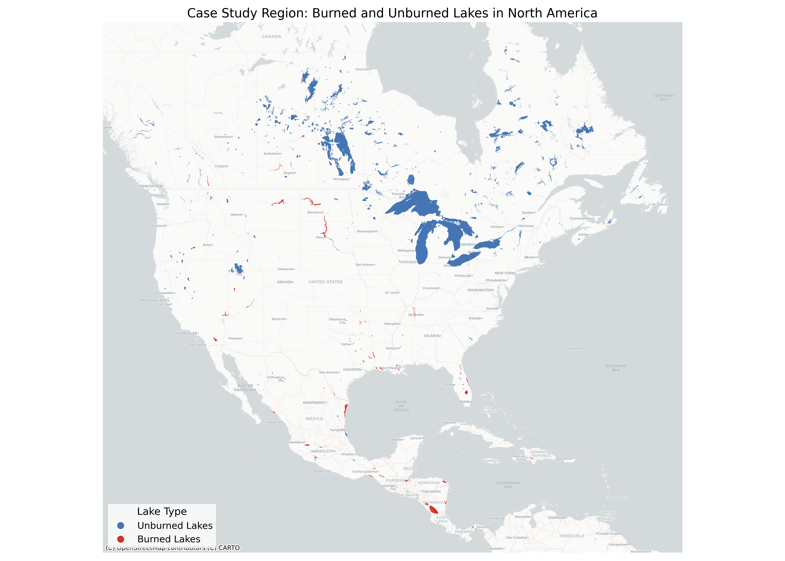
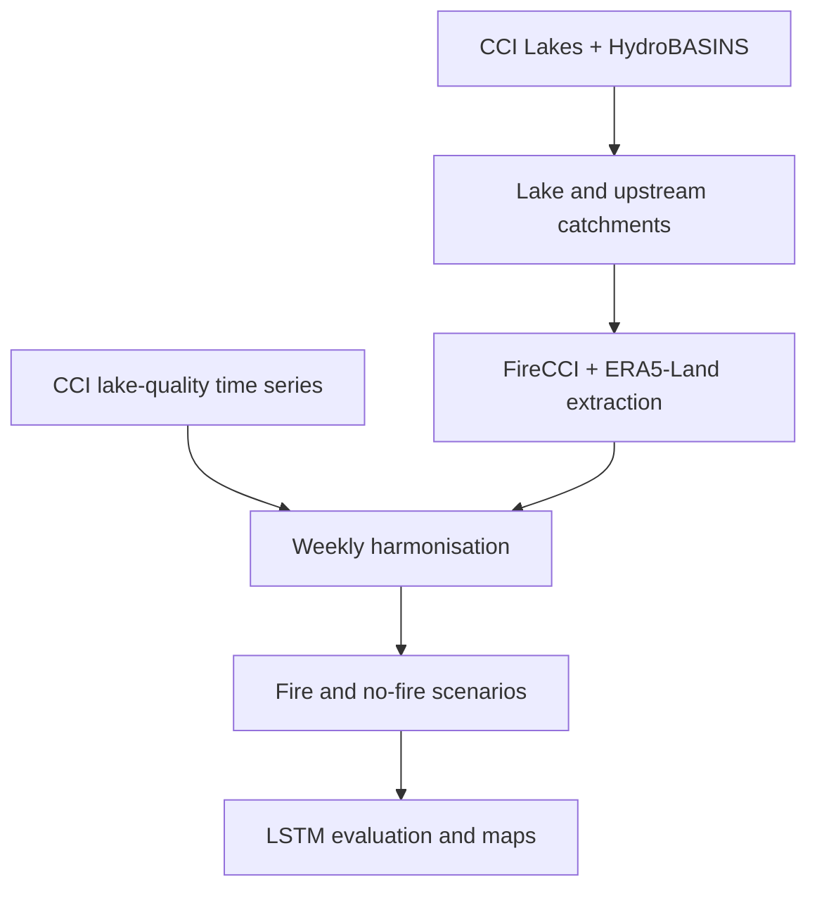

# Wildfire Effects on Lake Water Quality

An Earth observation and machine-learning workflow for exploring how wildfire
exposure and catchment conditions relate to weekly lake water-quality time
series. The analysis was developed during 2024–2025 in a collaborative CNR
Italy / Politecnico di Milano project and supported a poster presented at the
ESA Living Planet Symposium 2025.

This repository is maintained by **Sadra Zahed Kachaee**. It records the actual
research workflow and its exploratory results; it is not a deployed forecasting
service and does not claim that wildfire caused the observed water-quality
changes.



## Research workflow



The numbered notebooks preserve the end-to-end sequence:

1. check lake and water-quality data coverage;
2. assign lakes to HydroBASINS Level 8 units and trace upstream catchments;
3. extract weekly ERA5-Land climate variables and FireCCI burned-area summaries;
4. aggregate, merge, and interpolate weekly lake-quality and environmental data;
5. construct fire-exposed and comparison datasets;
6. train and evaluate LSTM scenarios with and without fire-related predictors;
7. create maps and diagnostic figures.

See [`notebooks/README.md`](notebooks/README.md) for the exact notebook order,
inputs, and outputs.

## Data sources

| Source | Use in this project |
| --- | --- |
| [HydroBASINS](https://www.hydrosheds.org/products/hydrobasins) | Level 8 sub-basins and upstream connectivity |
| [ESA CCI Lakes](https://climate.esa.int/en/projects/lakes/data/) | Lake polygons and satellite-derived lake variables, including chlorophyll-a, turbidity, and surface-water temperature |
| [FireCCI51](https://developers.google.com/earth-engine/datasets/catalog/ESA_CCI_FireCCI_5_1) | Monthly burned-area information aggregated by lake catchment |
| [ERA5-Land Daily Aggregated](https://developers.google.com/earth-engine/datasets/catalog/ECMWF_ERA5_LAND_DAILY_AGGR) | Air and lake temperature, precipitation, and runoff predictors |

Raw source files and most derived arrays are not committed. A representative
2019 ERA5-Land weekly export is retained in [`data/example/`](data/example/) so
the table structure can be inspected without downloading the full project data.
Obtain the remaining inputs from the official providers or through an
appropriately authorized project-data channel.

## Repository structure

```text
.
|-- notebooks/          # Ordered research workflow (00–16)
|-- data/example/       # One representative derived table
|-- docs/figures/       # Curated maps and model diagnostics
|-- docs/reports/       # Historical technical reports
|-- docs/tables/        # Predictor summary
|-- scripts/            # Repository and notebook quality checks
|-- tests/              # Lightweight structural tests
`-- requirements.txt    # Python environment
```

## Setup

Python 3.10 or newer is recommended.

```bash
git clone https://github.com/nazizahed/Lake_Water_Quality.git
cd Lake_Water_Quality
python -m venv .venv
source .venv/bin/activate  # Windows: .venv\Scripts\activate
python -m pip install --upgrade pip
python -m pip install -r requirements.txt
```

The notebooks expect untracked source data under `Datasets/`. Follow
[`data/README.md`](data/README.md) to create the local folder layout. For the
Earth Engine stages, authenticate and provide your own Cloud project and
catchment asset:

```bash
export EE_PROJECT="your-google-cloud-project"
export EE_CATCHMENTS_ASSET="projects/your-project/assets/your-catchments"
jupyter lab
```

Run notebooks in the order documented in [`notebooks/README.md`](notebooks/README.md).
Several stages submit asynchronous Earth Engine exports, so completing the
entire workflow requires monitoring those tasks before continuing.

## Results and interpretation

The preserved experiments compare LSTM scenarios across fire-exposed and
comparison lakes. The stored diagnostics show that adding fire-related
predictors improved the historical aggregate evaluation on the fire-exposed
test group, while performance varied substantially among individual lakes.
These are exploratory model diagnostics, not evidence of causal wildfire
effects or an operational prediction system.

The recorded metrics and their limitations are reported transparently in
[`docs/results.md`](docs/results.md).

## Reproducibility status

- Notebook outputs and execution counters are intentionally stripped from Git;
  selected results are preserved as named figures and reports.
- The original notebooks used external CCI files, Earth Engine assets, and
  generated NumPy/model artifacts that are not redistributable here as a
  complete dataset.
- Historical LSTM runs did not record a complete environment lock file or all
  random seeds. Exact numerical reproduction is therefore not claimed.
- CI checks notebook integrity, Python syntax, documentation links, and the
  schema of the included example table; it does not rerun Earth Engine exports
  or model training.

See [`docs/reproducibility.md`](docs/reproducibility.md) for details.

## Project history and reuse

The analysis was developed in 2024–2025. Repository structure, documentation,
and automated checks were cleaned in 2026 without replacing the original
scientific code or retrospectively regenerating its results.

No software licence is currently granted. The work originated in a
collaborative research setting, so reuse terms should be agreed with the
contributors before redistributing code, data, or derived products.
