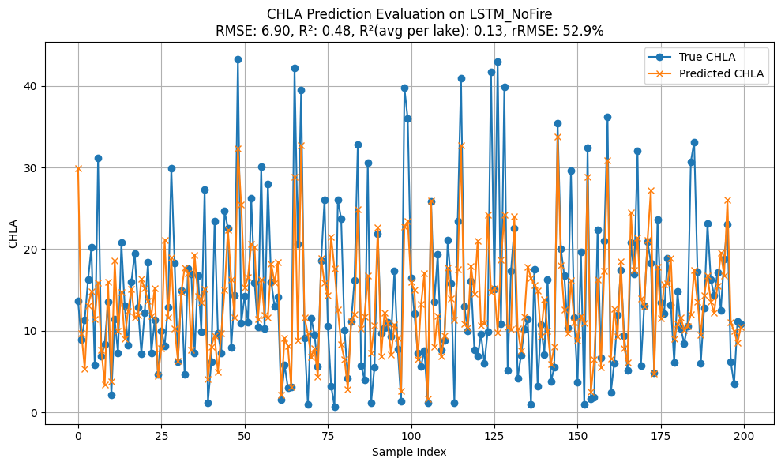
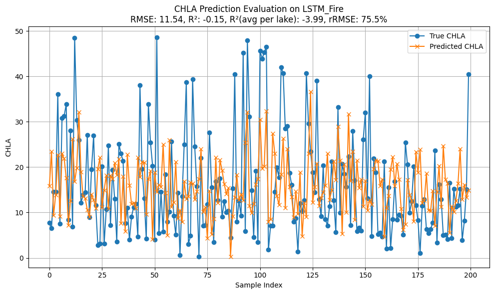
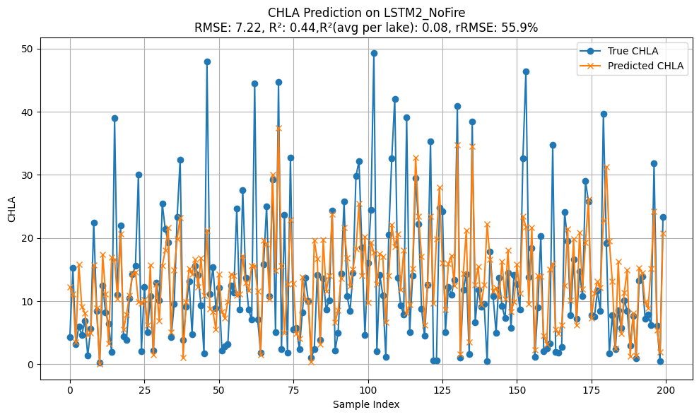
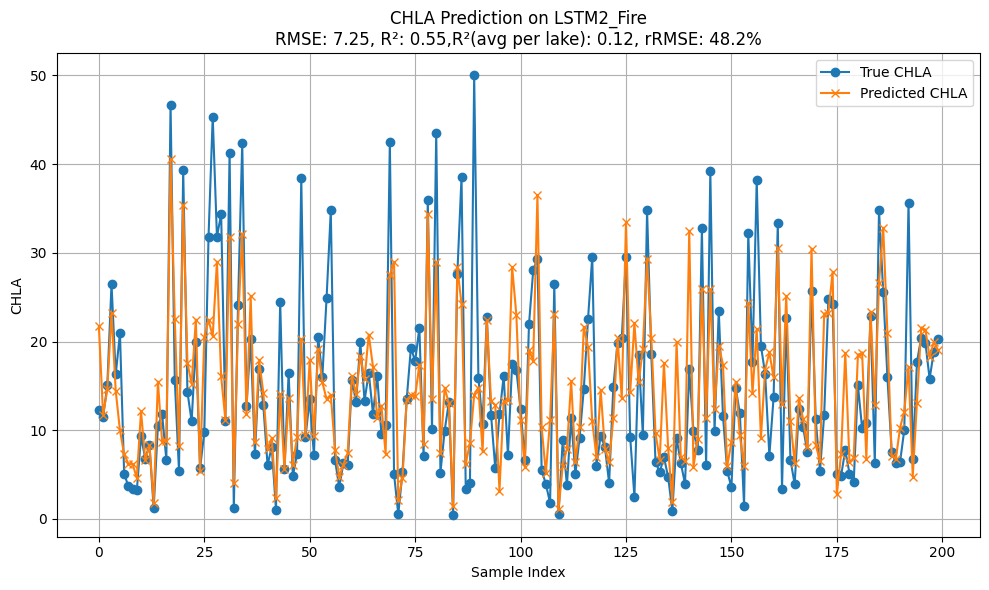

# Recorded exploratory results

The table below transcribes metrics displayed in the historical evaluation
figures retained in `docs/figures/`. The repository cleanup did not rerun or
selectively replace these experiments.

| Predictor scenario | Evaluation group | RMSE | Aggregate R² | Mean per-lake R² | Relative RMSE |
| --- | --- | ---: | ---: | ---: | ---: |
| Without fire predictors | No-fire lakes | 6.90 | 0.48 | 0.13 | 52.9% |
| Without fire predictors | Fire-exposed lakes | 11.54 | -0.15 | -3.99 | 75.5% |
| With fire predictors | No-fire lakes | 7.22 | 0.44 | 0.08 | 55.9% |
| With fire predictors | Fire-exposed lakes | 7.25 | 0.55 | 0.12 | 48.2% |

## Diagnostic figures

### Scenario without fire predictors

### Scenario with fire predictors

## Interpretation limits

- The aggregate results suggest that the scenario including fire-related
  predictors fit the recorded fire-exposed evaluation group better than the
  scenario without them.
- Performance was heterogeneous across lakes. Negative mean per-lake R² in the
  baseline fire evaluation shows that an aggregate metric alone can obscure
  poor lake-level transfer.
- The notebooks are exploratory and do not establish a causal effect of fire.
- The historical split, interpolation, scaling, feature construction, and lack
  of fully recorded random seeds limit exact independent reproduction.
- These metrics should not be presented as operational forecast performance or
  generalized beyond the recorded case-study data.

The technical reports in `docs/reports/` retain additional development notes
and should be read as historical project documentation rather than a peer-
reviewed methods specification.
